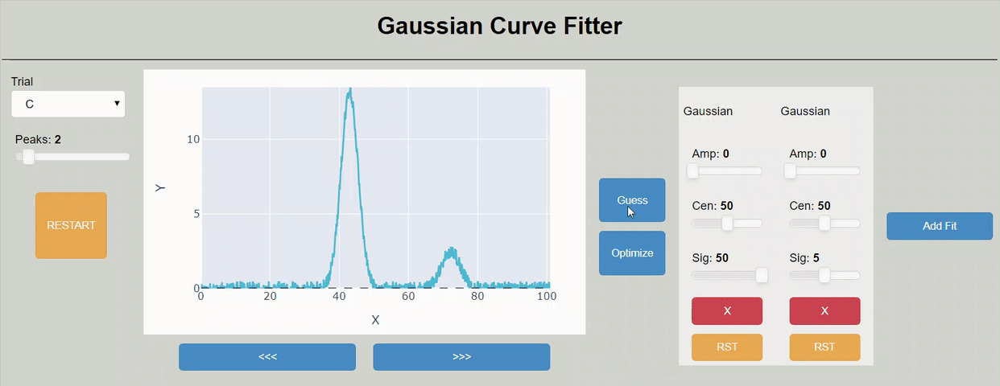

# Curve Fit

Curve Fit is a tool for simplifying the common scientific process of fitting Gaussian curves to data. 

You can play with it [here](http://brianlerner.me/curve-fit) using sample data.
Or you can clone this repo to easily use it with your own data.

I plan to update the Wiki with instructions, but the use should be intuitive.
The workflow is simply:
1. Pick sample data
2. Use *guess* to generate expected number of Gaussian fits
3. Use *optimize* to apply non-linear least squares method to fits
4. Adjust individual Gaussian fits as needed

